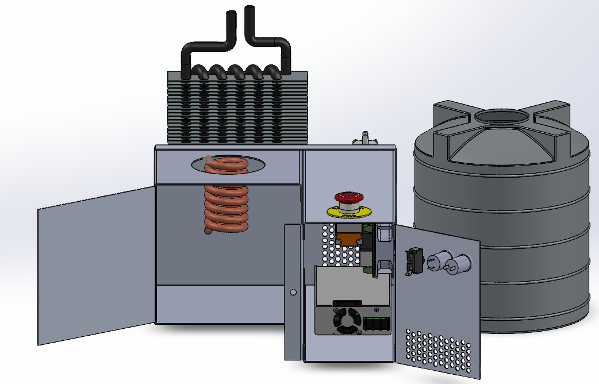
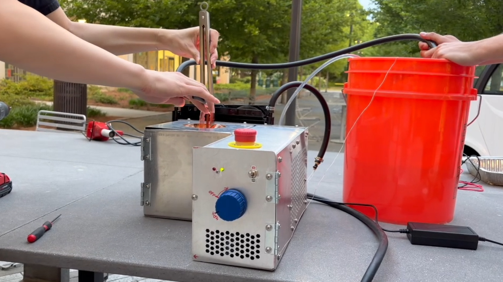

  

<h3 align="center">GT Senior Design Project Spring 2026</h3>

## Overview
OpenForge is an open-source, low-cost, hobbyist-level induction furnace created to reduce the cost barrier to entry for metalworking and rapid prototyping.

  

## Documentation
### [Guides](docs/guides/README.md)
  1. [Setup](docs/guides/setup.md)
  2. [Usage](docs/guides/usage.md)
  3. [Develop](docs/guides/dev.md)
  4. [Debug](docs/guides/debug.md)

### [Reference](docs/reference/README.md)
  * [Architecture](docs/reference/arch.md)
  * [Configuration](docs/reference/configs.md)

## Demo Video

  

## The Team
|      | Profile | Major |
| :--: | :------: | :----: |
|  | [@m24842](https://github.com/m24842) | EE |
|  | [@mollyg27](https://github.com/mollyg27) | ME |
|  | [@Dmay37](https://github.com/Dmay37) | EE |
|  | [@14joragu](https://github.com/14joragu) | EE |
|  | [@61olihar](https://github.com/61olihar) | ME |
<!-- |  | [@](https://github.com/) | -->

## Acknowledgments
Special thanks to __Dr. Lukas Graber__ and __Dr. Peter Hesketh__ for their guidance, insight, and support throughout this project.
